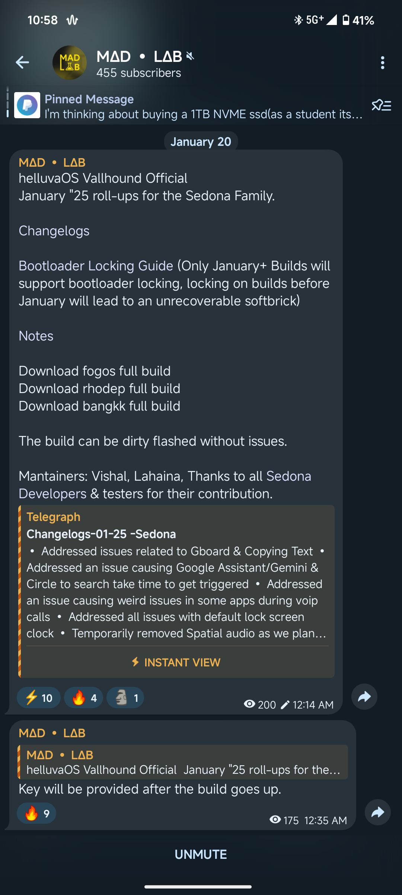

# MiSans_Module
This is a font module to replace boring stock Roboto to Mi Sans.

Ensure that you have roboto as your default font otherwise it'll not work.

Only Magisk is tested ans working as of now, idk about APatch and KSU/KSUNeXt.

Here's some Screenshots of how the font looks.

